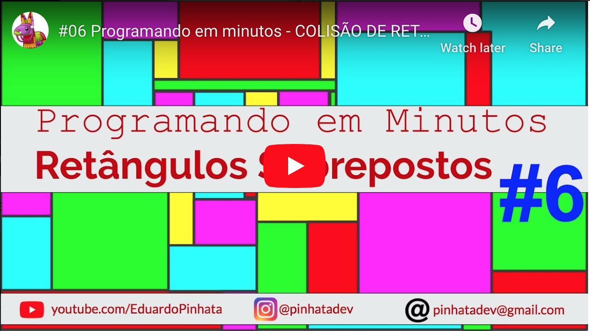

# Retângulos sobrepostos

Este projeto mostra como identificar quando dois retângulos se sobrepõe.
A explicação fica clara no video abaixo.

## Simulação

Entre  para testar uma simulação completa ou a simulação do vídeo do YouTube.

## Slides

Os slides usados no video estão disponíveis .
